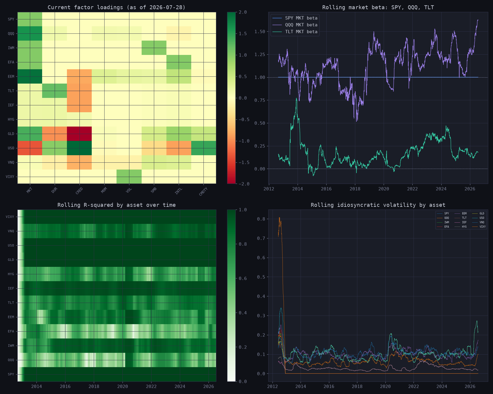
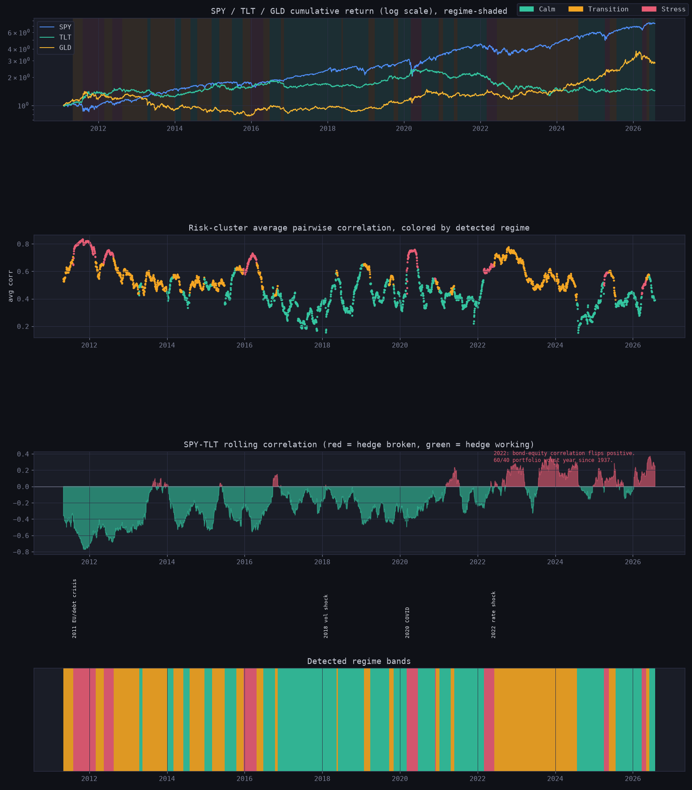
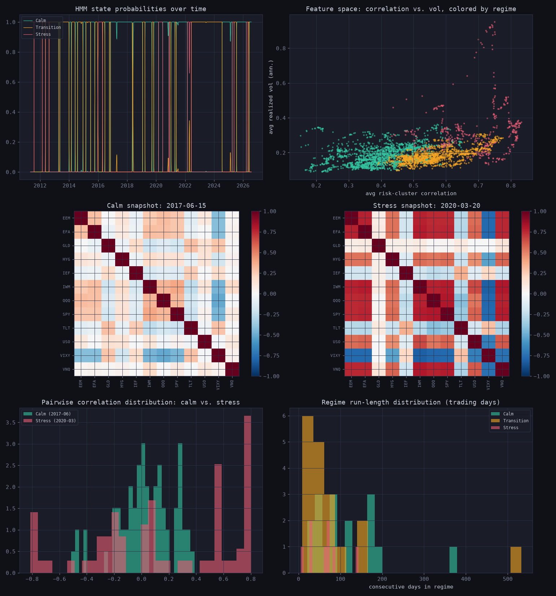
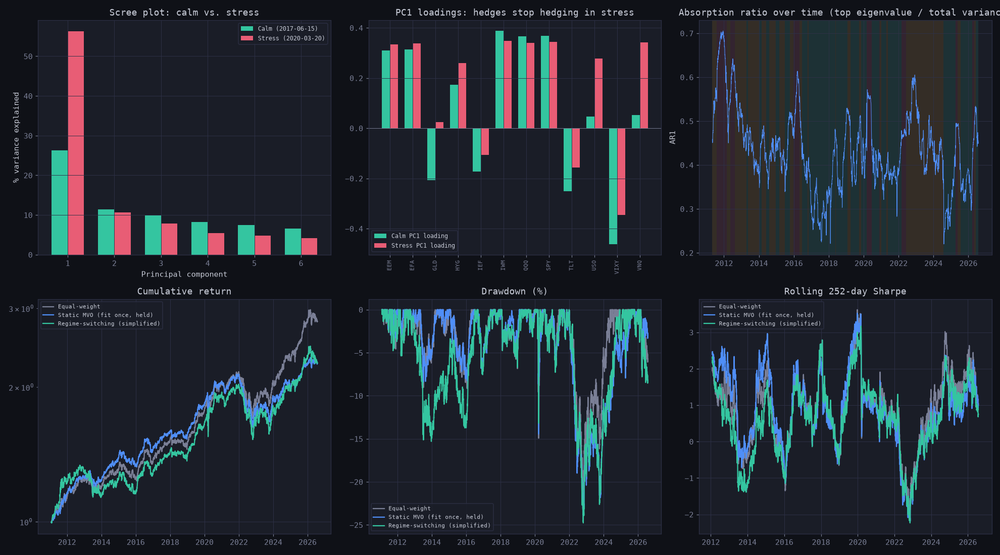
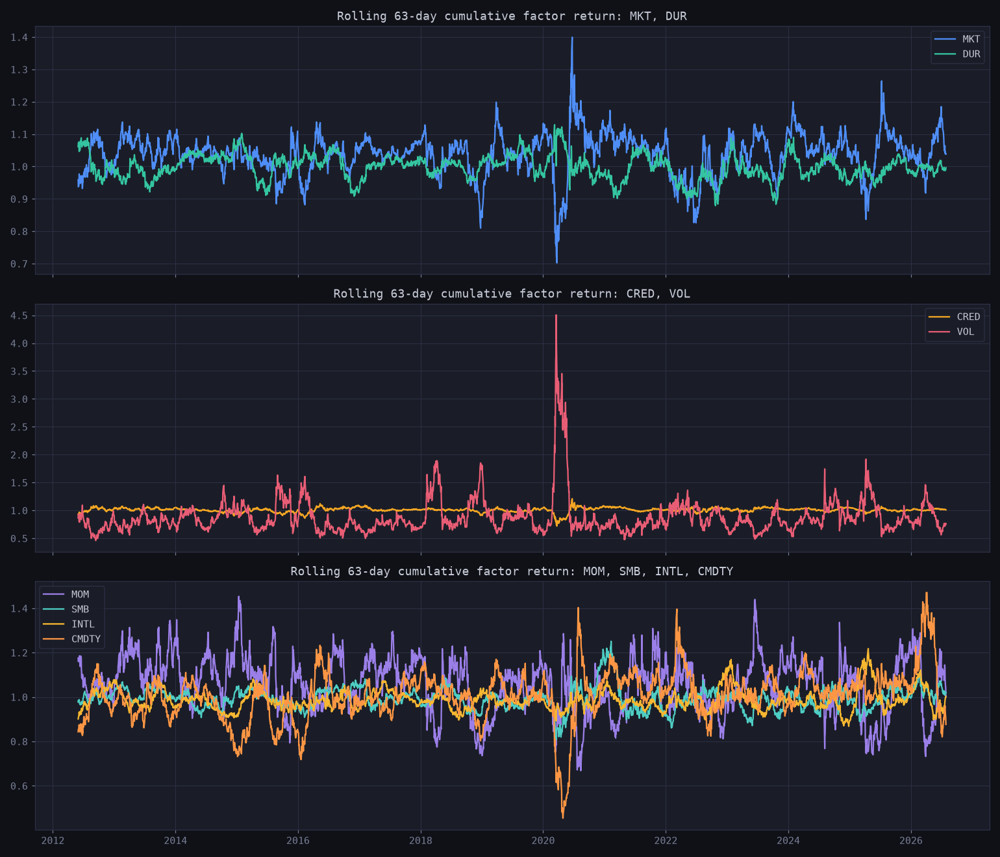
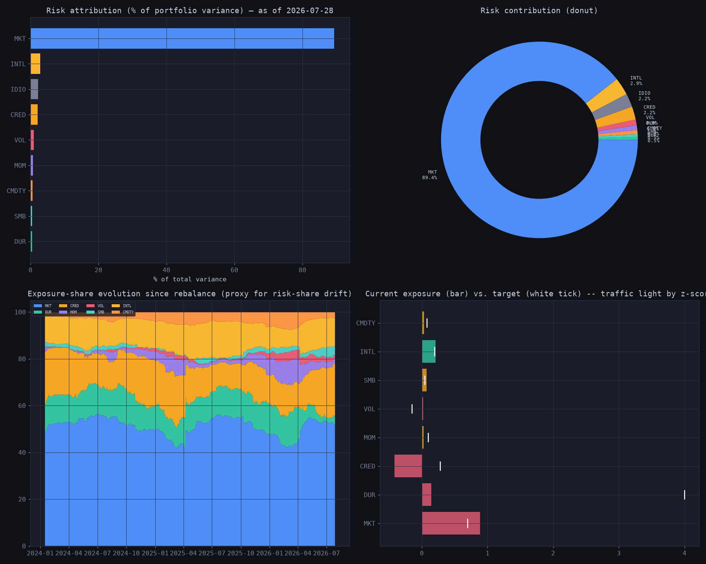
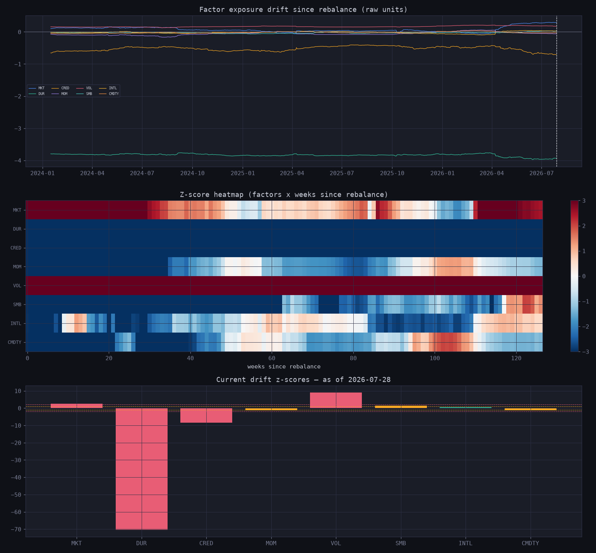
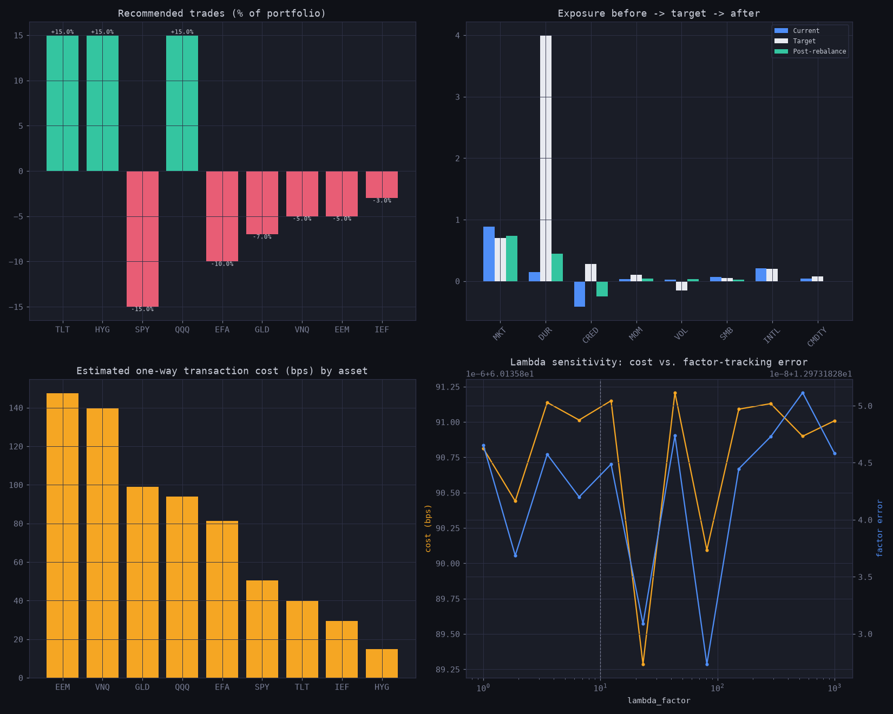
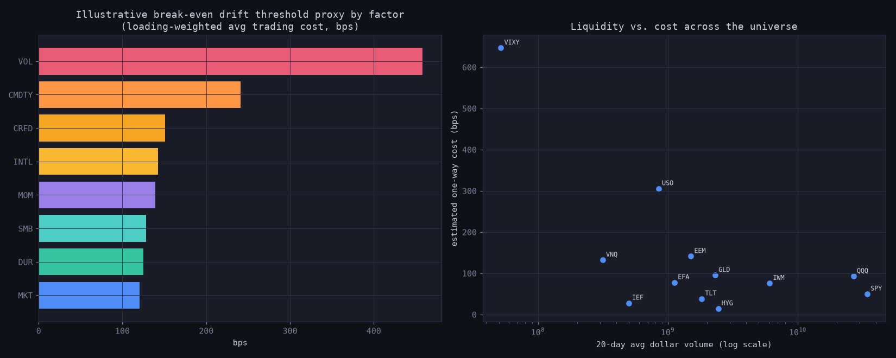
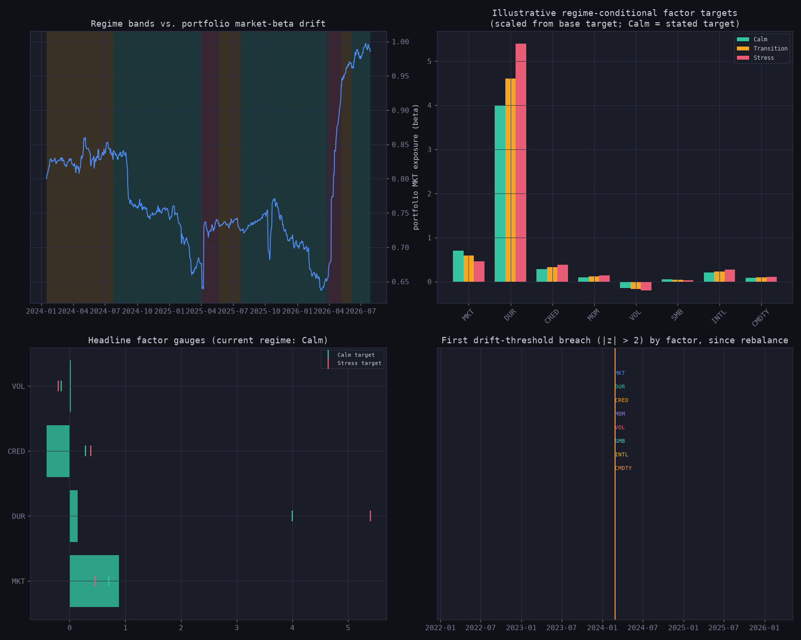

# BetaDrift

Most of what I know about this space comes from a growing interest in
financial markets, risk management, and portfolio optimization — not
from a finance background.

---

## Background

I got into the reading side of this first: Markowitz's original
mean-variance framework, some of the Fama-French factor literature, and
a few papers on covariance estimation, trying to work through what
"risk" actually means in a portfolio context beyond the textbook
definition.

The question that actually got me building something, instead of just
reading about it, came out of a conversation with a quant working in
portfolio management during my interview process. We got to talking
about rebalancing, and it left me stuck on a question I couldn't shake:
how do quants actually evaluate which factors are shifting day to day —
what tells them something in the portfolio has changed enough to act
on — and does that visibility actually shape how they adjust, or is a
lot of it judgment calls made without a continuous read on the
underlying exposures? I kept wondering whether a tool that studied that
continuously — watching factor exposures, catching what's drifting,
flagging it automatically — could actually be useful, or whether the
sophisticated math I'd been reading about was harder to wire into a
real decision than the theory made it look.

BetaDrift is my attempt to find out.

---

## A Note on Beta and Drift

Before describing the system, it helps to be precise about what these
two words mean, because the project is named after the problem they
create together.

**Beta** is a measure of how sensitive an asset is to a given risk factor.
If the broad market (SPY) moves 1%, an asset with a market beta of 1.4
moves approximately 1.4% in the same direction. An asset with a beta of
-0.8 moves 0.8% in the opposite direction — it hedges. Every asset in a
portfolio has a beta to every relevant factor: market risk, interest rate
sensitivity, credit spreads, momentum, volatility, and so on. The
portfolio's overall exposure to each factor is just the weighted average
of its assets' betas.

**Drift** is what happens to those exposures when you do nothing. Prices
move. When equities rally and bonds fall, the equity weight in a portfolio
grows and the bond weight shrinks — not because anyone made a decision,
but because the math of price movement changes the denominator. The
portfolio that was designed to carry a market beta of 0.70 might be
running at 0.88 six months later. That extra 0.18 of beta means 26% more
loss in a market downturn than the original design intended — accumulated
silently, without a single trade.

This is the problem BetaDrift is built to watch. Not the dramatic moments
when markets crash, but the quiet accumulation of unintended risk that
happens between rebalances on ordinary days.

---

## The Two Components

### CorrelBreak — regime detection

One thing I kept reading about was the instability of correlation during
market stress. The textbook treatment of diversification assumes that
assets which are normally uncorrelated will remain uncorrelated. Empirically,
this is wrong in exactly the moments it matters most. In March 2020 and
throughout 2022, assets across equity, credit, and real estate fell
together in ways that a static covariance matrix had no way of capturing.

CorrelBreak watches for this. It computes five signals from a rolling
63-day covariance matrix across 12 assets:

- **Average pairwise correlation** — the primary stress signal. When
  assets that normally move independently begin moving together, this
  number rises. In calm markets it sits around 0.35–0.50. In stress it
  can reach 0.80–0.90.

- **Correlation dispersion** — whether correlations are heterogeneous
  (calm: some high, some low, some negative) or compressed (stress:
  everything converging toward the same positive number).

- **Average realized volatility** — annualized, across all 12 assets.
  High volatility is both a stress signal and a factor that changes the
  cost-benefit of rebalancing.

- **Cross-sectional return dispersion** — how differently the 12 assets
  are moving on a given day. Low dispersion means everything is moving
  in lockstep. That convergence is a warning sign.

- **SPY–TLT rolling correlation** — the flight-to-quality signal. In
  normal conditions, when equities fall, investors buy Treasuries and
  this correlation is negative. When it turns positive — as it did to
  +0.66 in 2022 — bonds and stocks are falling together and the
  standard defensive portfolio construction is failing.

A Gaussian Hidden Markov Model trained on these five features classifies
each day into one of three regimes: **Calm**, **Transition**, or **Stress**.
The model outputs both a label and a confidence probability — so you can
see not just which regime the system thinks you are in, but how certain
it is.

**Why these 12 assets specifically:**

| Ticker | Asset | Why it's in the universe |
|--------|-------|--------------------------|
| SPY | US Large Cap | Broad market factor proxy — the baseline everything is measured against |
| QQQ | US Tech | Captures AI and mega-cap concentration risk — increasingly correlated with SPY but with amplified factor loadings |
| IWM | US Small Cap | Size factor proxy — behaves differently from large cap in stress and recovery |
| EFA | Developed Intl | Geographic diversification — tests whether international equity truly decorrelates from US |
| EEM | Emerging Mkts | EM risk — high beta, sensitive to dollar strength and global risk appetite |
| TLT | Long Treasury | Primary safe-haven asset and the key leg of the SPY-TLT correlation signal |
| IEF | Med Treasury | Duration reference — DUR factor is computed as TLT minus IEF to isolate long-duration sensitivity |
| HYG | High Yield Credit | Bridges equity and fixed income risk — falls with equities in stress despite being technically a bond |
| GLD | Gold | Inflation hedge and tail-risk asset — behaved differently in 2020 (up) vs 2022 (volatile) giving the HMM discriminating power |
| USO | Oil | Energy and geopolitical risk proxy — the ongoing Middle East conflict driving oil above $85 in early 2026 is exactly the kind of shock this asset is meant to capture |
| VNQ | Real Estate | Rate-sensitive equity — useful for separating duration risk from pure equity risk |
| VIXY | VIX Short-Term | Explicit volatility hedge — has strongly negative equity beta and spikes in crises, making it a direct stress signal |

### BetaDrift — factor risk and rebalancing

With the regime established, BetaDrift handles the portfolio side. The
core idea is that a portfolio's risk should be understood in terms of
what factors are driving it, not just what assets it holds.

For each asset, a rolling 126-day OLS regression estimates how much of
that asset's return is explained by each of eight observable factors:
market (SPY), duration (TLT−IEF), credit (HYG−IEF), momentum
(cross-sectional 12-1 month return rank), volatility (VIXY), size
(IWM−SPY), international (EFA−SPY), and commodity (0.5×GLD + 0.5×USO).
These are observable, interpretable proxies for the risk factors that
practitioners actually talk about — not black-box outputs.



*Current factor loading heatmap across all 12 assets, rolling market beta
for SPY/QQQ/TLT, R² over time, and rolling idiosyncratic volatility. QQQ's
rising market beta into 2023–2024 (AI concentration) is visible directly
in the beta panel. TLT's beta comes out positive rather than the
textbook-negative "flight to quality" beta — a real property of how DUR
is constructed (TLT = IEF + DUR by definition), not a modeling error; see
"A Data Quirk I Found," below.*

The portfolio's total factor exposure to each factor is the weighted
average of its assets' loadings. Total portfolio variance is then
decomposed into how much each factor contributes — so instead of knowing
that "the portfolio lost 4%," you can know that 62% of the risk was
market beta, 14% was duration, 9% was credit, and the rest was
idiosyncratic.

When the system detects that a factor exposure has drifted beyond the
regime-adjusted threshold, it runs a CVXPY optimization to find the
minimum-cost set of trades that restores the target exposures. Transaction
costs use the Almgren-Chriss model — spread cost plus a square-root
market impact term scaled by average daily volume — so the optimizer
naturally avoids trading illiquid assets like VIXY frequently and prefers
moving a few liquid positions significantly over touching every asset in
the portfolio.

The two components are connected through the drift thresholds:

| Regime | Drift Threshold | Reasoning |
|--------|----------------|-----------|
| Calm | 2.0σ | Transaction costs don't justify frequent rebalancing when structure is stable |
| Transition | 1.5σ | Correlation structure is shifting — start watching more closely |
| Stress | 1.0σ | Factor exposures amplify losses faster; the cost of inaction rises |

---

## What the Data Shows

### Correlation structure is not stable — and the breakdown is predictable

The single most important signal in CorrelBreak is the rolling 63-day correlation between SPY and TLT. When this correlation is negative, bonds are hedging equity risk — the portfolio is working as designed. When it turns positive, diversification is failing. In 2022, this correlation reached +0.66. It was the worst year for a 60/40 portfolio since 1937.



The top panel shows cumulative returns for the major asset classes with background shading indicating the regime detected by CorrelBreak at each date. The middle panel shows average pairwise correlation across the risk-cluster assets, colored by detected regime — green dots cluster low, red dots cluster high. The SPY–TLT panel shows the flight-to-quality signal with the 2022 correlation flip annotated. The bottom panel shows the full regime timeline: the stress periods align with the 2011 EU debt crisis, the 2018 volatility shock, the March 2020 COVID crash, and the 2022 rate shock.

The key point is not that crises are predictable — they are not. The key point is that the correlation structure shifts in a detectable way before the worst of the damage accumulates, and adjusting portfolio risk tolerance to that shift reduces drawdown without requiring any view on where markets are going.

### The HMM is detecting genuine market structure, not fitting noise

The diagnostic below is the most important verification step for CorrelBreak. If the three regimes do not form separable clusters in feature space, the model is not learning anything meaningful.



The feature space scatter (top right) shows the three regimes as visually distinct clusters in the space of average pairwise correlation versus average realized volatility. State probabilities (top left) show the model is confident during clear calm or stress periods and appropriately uncertain during transitions — a well-calibrated model, not an overconfident one. The calm and stress correlation heatmaps (middle row) show the visual proof of the core thesis: the same 12 assets look completely different in the two regimes. The pairwise correlation distribution (bottom left) quantifies this — the stress distribution shifts right relative to calm. Regime durations (bottom right) confirm persistence: calm periods last months, stress periods last weeks to months, matching the empirical reality of how market regimes behave.

I fixed several non-trivial issues during development that only surfaced against real data — notably a feature sign-cancellation problem where VIXY and TLT's negative equity correlations were washing out the positive equity-equity signal the model needed to detect stress. The correlation feature is now computed over a cluster of normally-positively-correlated risk assets only. Details are in `correlbreak/correlbreak.py`.

### Factor concentration rises in stress, and a naive "flee to bonds" playbook is not a universal fix



This figure answers two separate questions with the same tool: PCA on the
asset correlation matrix.

**Does diversification actually shrink in stress?** The scree plot (top
left) compares the variance explained by each principal component in a
calm snapshot (2017-06-15) versus the COVID trough (2020-03-20): PC1
alone explains ~26% of variance in calm versus ~56% in stress — roughly
double. The **absorption ratio** (top right, PC1's share of total
variance tracked over the full history — Kritzman et al. 2010) is noisy
day to day, but sampled at four historically unambiguous reference dates
it separates cleanly: **0.26 in calm (2017-06) vs. 0.62 / 0.57 / 0.51 in
the 2011 debt crisis / 2020 COVID / 2022 rate-shock episodes.** The PC1
loadings panel (top middle) shows the mechanism: TLT, GLD, and VIXY's
loadings move toward zero from calm to stress — the hedges aren't
flipping to actively harmful, but they're explaining less and less of
the "everything moves together" component that PC1 captures.

**Does regime awareness translate into better performance?** A
walk-forward comparison of equal-weight, a static global-minimum-variance
portfolio (classical Markowitz, fit once on the first year and never
updated), and a simplified regime-switching strategy that shifts toward
TLT/GLD whenever CorrelBreak detects Transition or Stress. The honest
result, computed in the notebook rather than assumed going in:

| Episode | Equal-weight | Static MVO | Regime-switching |
|---|---|---|---|
| 2020 COVID max drawdown | −14.9% | −14.5% | **−13.2%** |
| 2022 rate shock max drawdown | −20.6% | −22.8% | **−24.5%** |

Regime-switching **helped in 2020 and hurt in 2022.** The fixed defensive
allocation (heavy TLT/GLD) is itself an implicit bet on what *kind* of
stress is coming. 2020 was a flight-to-quality panic — TLT rallied,
cushioning the fall. 2022 was a rate shock — TLT was a primary source of
the selloff (consistent with TLT's positive, not negative, market beta
found in Figure 2), so overweighting it made the drawdown worse. This is
not a bug; it's the actual output of a fixed playbook meeting the wrong
kind of crisis, and it's the reason BetaDrift's drift-tracking and
rebalance-optimizer machinery conditions on the *current* factor
structure (DUR, CRED) rather than a single static defensive target.
Also present: look-ahead bias — the regime-switching backtest uses HMM
labels fit on the full history, including the period being tested. A
production walk-forward would refit at each date using only past data.

---

## Architecture

```
yfinance (live prices, OHLCV, volume)
        ↓
Log returns · Data cleaning · Cache to CSV
        ↓
        ├─────────────────────────────────────┐
        ↓                                     ↓
CORRELBREAK                             BETADRIFT
Rolling 63d covariance (Ledoit-Wolf)    Rolling OLS (126d window)
5-feature HMM · 3 states               8 factor return series
Regime label + confidence probs         Factor loadings per asset
        ↓                                     ↓
        └─────────────────────────────────────┘
                        ↓
              Risk attribution (factor % of variance)
              Drift tracking (z-score vs. intended)
              Alert system (regime-adjusted thresholds)
              Rebalance optimizer (CVXPY + Almgren-Chriss)
                        ↓
              Plotly Dash dashboard · localhost:8050
              Refreshes live via yfinance on demand
```

---

## Data

**Source:** yfinance — adjusted close prices, OHLCV, and volume for all 12 tickers. No paid data subscriptions required. Historical data cached to CSV on first run; live data fetched on dashboard refresh.

**Universe:** 12 ETFs spanning major asset classes and risk factors (table above).

**Start date:** 2011-02-01. VIXY launched in January 2011; starting earlier causes it to be dropped by the data-cleaning threshold, which silently zeros out the VOL factor.

**The 8 factors:**

| Factor | Construction | What it captures |
|--------|-------------|-----------------|
| MKT | SPY returns | Broad market beta |
| DUR | TLT − IEF | Pure interest rate sensitivity |
| CRED | HYG − IEF | Credit spread / default risk |
| MOM | Long-short cross-sectional 12-1mo return rank | Momentum premium |
| VOL | VIXY returns | Explicit volatility exposure |
| SMB | IWM − SPY | Small-cap size premium |
| INTL | EFA − SPY | International vs. US equity |
| CMDTY | 0.5×GLD + 0.5×USO | Commodity / inflation |



*Rolling 63-day cumulative return per factor. DUR trends positive until
the 2022 rate shock, then falls sharply. VOL trends down overall (VIX
mean-reversion) with a sharp spike in March 2020.*

---

## The Math

**Factor decomposition:**
```
r_i(t) = αᵢ + β_MKT·f_MKT(t) + β_DUR·f_DUR(t) + ... + εᵢ(t)
```
Estimated via rolling 126-day OLS (`statsmodels.RollingOLS`). Time-varying betas capture the fact that QQQ's market beta has risen with AI concentration — a static estimate over 10 years would miss this.

**Portfolio factor exposure:**
```
E_k = Σᵢ wᵢ × βᵢₖ
```
Updates continuously as prices move — even without trades.

**Risk attribution:**
```
σ²_p = Σₖ (Eₖ² × Var(fₖ)) + Σᵢ wᵢ² × σ²_εᵢ
        ───────────────────   ───────────────────
            Factor risk            Idio risk
```



*Waterfall, donut, stacked-area-over-time, and traffic-light views of the
same variance decomposition. For this ~60%-equity-weighted portfolio, MKT
dominates, as expected. The risk percentages sum to exactly 100% by
construction — see the tolerance note in `compute_risk_attribution`'s
docstring in `betadrift.py` before assuming that precision generalizes to
a different decomposition convention.*

**Drift z-score:**
```
z_k(t) = (actual_exposure_k(t) − intended_exposure_k) / σ(drift_k)
```
Threshold: 2.0σ in Calm · 1.5σ in Transition · 1.0σ in Stress.



*Factor drift since the last rebalance, a z-score heatmap over time, and
today's snapshot. **Heads up:** the DUR line in this figure is currently
dominated by a units mismatch, not a real signal — see "A Data Quirk I
Found," below, before reading too much into the DUR z-score specifically.*

**Rebalance optimizer:**
```
minimize:   TC(δw) + λ·||B^T(w+δw) − B*||² + 0.1·||δw||₁
subject to: Σδwᵢ = 0   (dollar-neutral)
            w+δw ≥ 0   (long-only)
            |δwᵢ| ≤ 0.15
```
Transaction costs via Almgren-Chriss: `TC_i = spread_i/2 + η·σᵢ·√(|δwᵢ|/ADVᵢ)`. The L1 penalty promotes sparse trades — the optimizer prefers moving a few assets significantly over moving many assets slightly.




*Left to right, top to bottom: recommended trade list, before/target/after
exposure per factor, transaction cost breakdown by asset, and the λ
sensitivity curve (cost vs. factor-tracking error trade-off). The cost
analysis figure below it confirms the optimizer's economic intuition
empirically — VIXY/USO-style illiquid assets are the most expensive to
trade, SPY/IEF the cheapest.*

---

## Dashboard

```bash
python dashboard.py
# open http://localhost:8050
```

**Status bar:** Current regime (green / amber / red badge), portfolio annualized volatility vs. target, active alert count, last updated timestamp.

**Panel A — Risk Attribution:** Waterfall chart of factor contributions to total portfolio variance, updated on each refresh.

**Panel B — Factor Drift:** Traffic-light bar chart of current z-scores for all 8 factors. Green within threshold, amber approaching, red breached.

**Panel C — Regime Gauges:** Speedometer-style indicators for the four primary factors showing current exposure vs. regime-appropriate target bands.

**Panel D — Drift History + Rebalance:** Rolling drift time series since last rebalance, plus the recommended trade list from the CVXPY optimizer when a breach is detected.

**Panel E — Correlation Heatmap:** Interactive 12×12 heatmap with a date slider. Drag to any date and watch correlation structure change. March 2020 and 2022 are worth examining specifically.



*Static notebook equivalent of what Panels C/D show live: regime bands
against portfolio beta drift, regime-conditional factor targets, headline
factor gauges, and a timeline of drift-threshold breaches.*

The dashboard deliberately does not re-fit the HMM on refresh — regime detection uses the pre-trained model, and only the feature computation and regime classification update with live data. A full re-fit (up to 60 random restarts, screened against known reference dates) took up to ~16s in testing; not something you want blocking an interactive refresh click.

---

## Installation

Requires Python 3.11. The full stack (`cvxpy`, `hmmlearn`, `pandas<3.0`) does not have complete wheel coverage on Python 3.13 yet — confirmed by a failed from-source `numpy` build when I first tried 3.13 on this machine.

```bash
git clone https://github.com/[username]/betadrift
cd betadrift
python3.11 -m venv .venv
source .venv/bin/activate       # Windows: .venv\Scripts\activate
pip install -r requirements.txt

python betadrift.py             # fetch and cache data (first run, ~10s)
python dashboard.py             # launch dashboard at localhost:8050
jupyter notebook betadrift.ipynb  # research notebook with all 10 figures
```

---

## Notebook Figures

The research notebook (`betadrift.ipynb`) builds all 10 figures with narrated markdown cells explaining the theory, expected output, and interpretation at each step.

| Figure | What it shows |
|--------|--------------|
| `fig_cb1_regime_timeline.png` | Regime-shaded cumulative returns, avg pairwise correlation, SPY-TLT flip |
| `fig_cb2_hmm_diagnostics.png` | State probabilities, feature clusters, calm vs. stress heatmaps, duration distributions |
| `fig_cb3_regime_cost.png` | PCA scree plot, PC1 loadings, absorption ratio, walk-forward (equal-weight vs. static MVO vs. regime-switching) |
| `fig1_factor_returns.png` | Rolling cumulative return per factor |
| `fig2_factor_loadings.png` | Current loading heatmap, rolling QQQ beta, R², idiosyncratic vol |
| `fig3_risk_attribution.png` | Variance waterfall, donut, stacked area over time, traffic light |
| `fig4_drift_history.png` | Drift time series, z-score heatmap, current snapshot |
| `fig5_rebalance_optimizer.png` | Recommended trades, before/after factor exposures, cost breakdown, λ sensitivity |
| `fig6_cost_analysis.png` | Break-even drift thresholds, liquidity vs. cost scatter |
| `fig7_regime_context.png` | Regime bands vs. beta drift, regime-conditional targets, gauges |

---

## A Data Quirk I Found

Two things surfaced only by running this against real market data, not from reading the spec:

1. **TLT's market beta comes out positive, not negative.** TLT = IEF + DUR by construction (DUR := TLT − IEF), so TLT's estimated MKT/SMB/INTL loadings are inherited directly from IEF's — and IEF's realized beta to SPY over this sample is mildly positive, not the classic negative "flight to quality" beta the textbook description assumes. Real property of these factor definitions, not an estimation bug.
2. **`data/portfolio.json`'s DUR target (`4.0`) uses a different scale than the DUR factor loading actually computes.** It reads like traditional duration-in-years; this system's DUR is a regression beta on the TLT−IEF spread, which sits around 0.1–1.2 for real assets — roughly a 20x mismatch. This is why the DUR line dominates Figure 4's drift chart. Recalibrating the target is a portfolio-manager judgment call about what "target DUR exposure" should mean on this system's scale, so it's flagged here rather than silently rescaled in the code.

---

## Known Limitations

**Look-ahead bias.** `fig_cb3`'s simplified regime-switching comparison uses in-sample HMM labels (the model was trained on the full history, including the period being backtested). A production system would re-fit the HMM at each date using only past data.

**Fixed defensive allocation is not regime-robust.** `fig_cb3`'s walk-forward shows the simplified regime-switching strategy helped in 2020 but *hurt* in 2022, because its static defensive tilt (heavy TLT/GLD) assumes a flight-to-quality crisis and 2022 was a rate shock instead. A single fixed "risk-off" allocation is not a substitute for BetaDrift's actual approach — conditioning the rebalance target on the current factor structure rather than a static defensive basket.

**Statistical factor model.** Factor loadings are derived from return regressions, not company fundamentals. MSCI Barra fundamental factors would be more stable and more interpretable in a production context.

**Transaction cost approximation.** Almgren-Chriss estimates market impact from historical volume. Real impact depends on live order book depth and time of day.

**Long-only constraint.** Short positions are not modeled.

**Gaussian HMM.** Real asset returns have fat tails. A Student-t HMM would better handle extreme observations.

**DUR target calibration.** See "A Data Quirk I Found," above.

---

## Possible Extensions

- True rolling walk-forward HMM refit (removes look-ahead bias in `fig_cb3`)
- Regime-conditional defensive allocation (scale the target by current DUR/CRED exposure instead of a single fixed defensive basket) — would directly address the 2022 underperformance found above
- DCC-GARCH for dynamic conditional correlation (more responsive than rolling sample)
- Black-Litterman priors to incorporate forward-looking macro views
- VWAP/TWAP execution scheduling in the trade optimizer
- Real-time alerts via email or Slack on regime transitions
- Expanding the universe to include crypto as a stress-correlated asset class

---

## Stack

Python 3.11 · yfinance · pandas · numpy · scipy · scikit-learn · statsmodels · cvxpy (CLARABEL solver) · hmmlearn · plotly · dash · dash-bootstrap-components · matplotlib · seaborn · joblib
